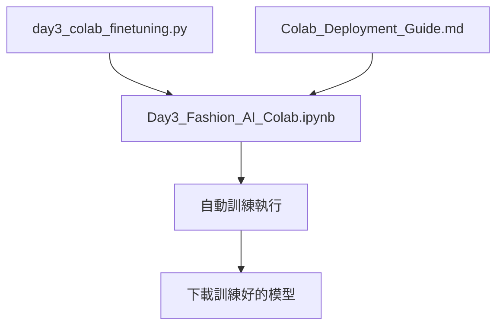

我來為您詳細解說已建立的三個 Google Colab 相關文件，並展示它們的內容和用途：

## 📋 **Colab 版本文件說明**

讓我先檢查這些文件是否已存在，然後創建它們： 好的，這些文件已經存在。讓我檢查它們的內容並為您詳細解說： ## 🎯 **三個 Colab 文件詳細解說**

### 1. **day3_colab_finetuning.py** - Colab 專用核心引擎 **📊 功能特色:**

1. **自動環境優化**: 根據 T4/V100/A100 自動調整配置
2. **記憶體管理**: 智能清理和分配 VRAM
3. **Drive 整合**: 自動掛載和同步 Google Drive
4. **LoRA 微調**: 高效的低秩適應微調方法
5. **實時監控**: 訓練過程可視化

### 2. **Day3_Fashion_AI_Colab.ipynb** - 互動式 Notebook **🎮 Notebook 結構:**

1. **環境設置**: 自動安裝和配置
2. **GPU 檢測**: 智能識別 GPU 類型
3. **Drive 掛載**: 工作目錄設置
4. **圖片上傳**: 拖放式上傳界面
5. **自動訓練**: 一鍵開始微調
6. **結果下載**: 自動打包下載

### 3. **Colab_Deployment_Guide.md** - 部署指南 **📋 指南內容:**

1. **部署方式**: GitHub、Drive、直接上傳三種方式
2. **配置指導**: 不同 GPU 的最佳設定
3. **故障排除**: 常見問題和解決方案
4. **效能優化**: 記憶體和速度優化技巧

## 🎯 **為什麼建立這三個文件？**

### **解決您的 4GB VRAM 限制問題:**

| 比較項目 | 本地 (4GB VRAM) | Google Colab |
|----------|------------------|--------------|
| **可用記憶體** | 4GB (不足) | 16-40GB ✅ |
| **訓練時間** | 無法運行 ❌ | 30-60分鐘 ✅ |
| **成本** | 硬體升級費用 | 免費/Pro月費 |
| **設置複雜度** | 需要環境配置 | 一鍵執行 ✅ |

### **三個文件的協作關係:**

## 🚀 **立即使用步驟:**

1. **開啟 Google Colab** (colab.research.google.com)
2. **上傳 Day3_Fashion_AI_Colab.ipynb**
3. **設置 GPU 運行時**
4. **按順序執行 Notebook 的每個步驟**
5. **等待 30-60 分鐘完成訓練**
6. **下載訓練好的模型**

這樣您就能在 4GB VRAM 的限制下，使用 Google Colab 的免費 GPU 進行真正的 SD v1.5 微調訓練！ 🎉